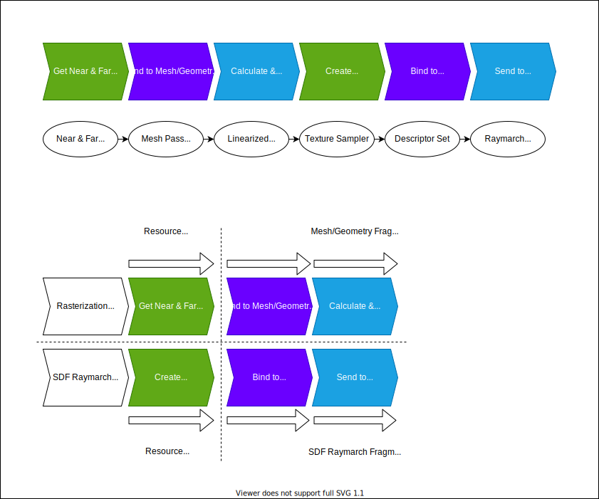
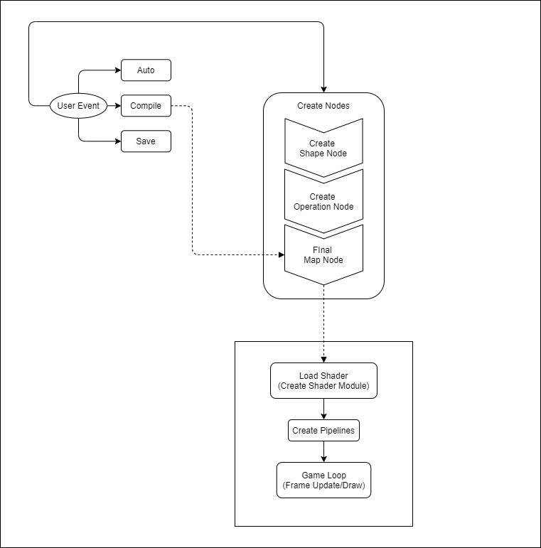

# SDF Ray4D Engine (masters-project)

## Requirements

- C++ 17 compiler
- cmake v3.12+ (tested with 3.19 - for faster builds use v3.16+)
- Bash Shell
- Qt v5.10+ (tested with 5.15)
- Vulkan SDK v1.2.x (tested with v1.2.176.1)

## Download

clone repository with its submodules:

- glslang (***Note*** The latest pull (09 Aug) from `glslang` has a typo in its cmake config.
  Please modify its `CMakeLists.txt` at line `144` to `endif(MSVC AND OVERRIDE_MSVCCRT)`.)
- nodeeditor

```shell
git clone --recursive https://github.com/hiradyazdan/masters-project
```

## Build

```shell
cmake -DCMAKE_TOOLCHAIN_FILE=${VCPKG_PATH} ..
cmake --build .
```

***Note:*** if on Windows, make sure vcpkg packages are 64-bit system compatible with `-DVCPKG_TARGET_TRIPLET=x64-windows`.

#### CMake Compilation Performance

***source file => compilation/translation unit => obj file => linker => executable***

Compiling source class implementations when split into multiple source files (i.e., Partial Class), to allow for
readability/maintainability, may increase the compilation time.

It essentially creates extra multiple `obj` files for each split source file which is the result of increase
in the number of compilation/translation units and therefore increase in the compilation time. There are a few ways
to alleviate this reducing number of compilation units and saving compilation time, as below:

- `UNITY_BUILD` (cmake 3.16+)
- `Pre-compiled Headers`/`PCH` (cmake 3.16+)
- `Module` Header Units (C++20 `Modules`)

Currently, `UNITY_BUILD` is used here, as `PCH` need more configuration and also
there's no `Module Header units` support for C++17 which is used in this project.

## Design

### SDF Raymarching (Sphere Tracing)

#### SDF Raymarched Objects Interaction with Mesh-based (Rasterized Geometry) Objects - Depth Calculation



In c

- https://www.iquilezles.org/www/articles/raypolys/raypolys.htm
- https://computergraphics.stackexchange.com/questions/7674/how-to-align-ray-marching-on-top-of-traditional-3d-rasterization
-

### Vulkan vs. DirectX vs. OpenGL

***Vulkan Advantages***

- Multi-threading & Multi-GPU
- Reducing driver overhead & CPU Load
  - preprocess/bake batches of calls in advance to submit to command queues per frame

### Vulkan Execution Model


### Qt Vulkan

#### High Level Architecture


***Support for Vulkan rendering was added to the Qt framework since v5.10***

- `QMainWindow`'s child class (`MainWindow`) instantiates `QVulkanInstance` and `QVulkanWindow`'s child (`VulkanWindow`), and sets the Vulkan instance to the `VulkanWindow`
- `QVulkanWindow` is the equivalent of `QOpenGLWindow`
- `QVulkanWindowRenderer` injects `QVulkanWindow` and implements Vulkan Device functions (`QVulkanDeviceFunctions`)
- `QVulkanDeviceFunctions` instance created by `QVulkanInstance` is used to:

    - Create/Destroy Shader Module
    - Create/Destroy Buffer
    - Get Buffer Memory Requirements
    - Allocate/Free Memory
    - Bind Buffer Memory
    - Map/Unmap Memory
    - Create/Destroy Descriptor Pool
    - Create/Destroy Descriptor SetLayout
    - Allocate/Update Descriptor Sets
    - Create/Destroy Pipeline Cache
    - Create/Destroy Pipeline Layout
    - Create/Destroy Graphics Pipeline
    - CmdBeginRenderPass
    - CmdEndRenderPass
    - CmdBindPipeline
    - CmdBindDescriptorSets
    - CmdBindVertexBuffers
    - CmdSetViewport
    - CmdSetScissor
    - CmdDraw

In contrast to using `GLFW`, `SDL` or Native API, above Vulkan implementations
are already abstracted and handled via `QVulkanWindow` and `QVulkanDeviceFunctions` where there's
no need to create extra classes and functionality for them.

This means, `VkDevice` and its functions can be taken from `QVulkanWindow` instance.
The same applies to all other `vk` prefixed functions which are invoked
by `QVulkanDeviceFunctions`instance.

`QVulkanWindowPrivate` acts as an internal class and, its instance is injected into `QVulkanWindow` which
manages all complex device related functionality including GPU-CPU Synchronization/Multithreading
and is hidden from the user.

#### Design Restrictions

- **VulkanWindow Inheritance**

  Currently, couldn't find a way to use one single class consuming and inheriting both `QVulkanWindow` and `QMainWindow` even with `protected` specifiers as they have same public methods signature and therefore cause ambiguous method name lookup.

  Also, instantiating the `QMainWindow` in `VulkanWindow` constructor to, instead, use the `resize` and `show`/`showMaximized` methods of `QVulkanWindow`, does not load an actual window and therefore cannot be used as a workaround.

  Note that, we could inherit `QWindow` to our `VulkanWindow` class and use `QVulkanFunctions` and `QVulkanInstance`, but the limitation would be that `QWidget` functionality is limited and can't have predefined places for Qt widgets.

  So, the only way is to inject (***Dependency Injection - DI***) or instantiate `VulkanWindow` in the `MainWindow` constructor, which may be better in terms of design and testability but with extra distinguished classes.

#### Performance & Memory Usage

###### GUI Overhead (Qt)

Although using a Native API could be the most performant way for a GUI application,
Qt as a wrapper around the native API has some features helping to lower the performance
bottleneck:

- Qt `Signal`-`Slot` fast mechanism (statically typed and MOC slot method calls)
- Qt Multithreading (QtConcurrent & QFuture) - equivalent for `std::async` & `std::future`

This performance however, may come as a cost of higher amount of memory usage.

###### Graphics API Overhead (Vulkan)

Memory Allocation is managed via`QVulkanDeviceFucntions` which has no
more overhead than if it was managed through `VMA` (Vulkan Memory Allocator),
which is a vulkan Memory Allocation Library, to simplify the creation and
allocation of resources, while giving access to Vulkan functions.

## Qt Widgets

TBC

## SDF Graph (Node Editor)



The graph is loaded only after the main window scene
and an initial render of a base shader. It was designed for simplicity and efficient usability to avoid any race condition
accessing the material instance in order to load dynamic shaders as they
require shader modules to have device functions already
available at their disposal.

Therefore, SDF Graph window/widget is activated by
clicking on a menu button by the user which provides access
to all required functionality to load dynamic shaders.

SDF Graph recompiles the shader which means the pipeline object will need to be updated
by the shader modification. However, as in Vulkan almost all objects are immutable, on shader recompilation,
the pipeline object is no exception and cannot be updated, so it needs to be recreated.

## Shaders (Vulkan Shaders - SPIR-V)

***SPIR-V*** Shaders on `OpenGL` are only available since ***[v4.6+](https://www.khronos.org/opengl/wiki/SPIR-V)***

SPIR-V shader compiler APIs:

- https://github.com/KhronosGroup/glslang
- https://github.com/google/shaderc

Vulkan SDK's `glslang` and `shaderc` are not available via cmake. However, `vcpkg` port of `glslang` has `glslangConfig.cmake` which allows `glslang` to be linked and made available via `cmake` with `#include`.

`shaderc` vcpkg port, also, doesn't have cmake config and cannot be available via `cmake`.

https://github.com/KhronosGroup/glslang/issues/2570

pulling `glslang` ~~or shaderc~~ with git submodule resolves the linking problem using cmake config from `vulkan samples` repo. `vcpkg` needs to be excluded if we pull in the git repository as otherwise, it will cause conflicts.

***GLSL Compiler Multithreading Issue***:

GLSL Compiler (`glslang`) cannot initialize and run synchronously in multiple threads, but can only run and compile exactly once per process, not per thread. Therefore, initial compiling & loading of multiple static shaders cannot be done async and in a separate thread each.

Also, because `pipelines initialization` directly depend on the result of the loaded shaders, running shader compilation and load in parallel with pipeline creation doesn't make sense as it either way has to wait for the result of the loaded shaders to be able to initialize a pipeline.

***Current Solution***

The best solution currently is to only pre-compile static shaders to `.spv` files at build-time, in order to have them load async. Then when SDF Graph dynamic shaders are to be compiled by the user at runtime, they queue up on separate threads to load into the scene without stalling/freezing the frames or any other real-time interaction.

This requires a specific algorithm to identify which shaders need to be picked up at compile time and which at runtime.

***SPIRV Notes***

- They do not validate `glsl` version `410` and below (because of second point as it lacks `binding` value, and they need uniform buffers binding).
- They do not validate uniforms without blocks (they need to be wrapped into ubo)
- `in` and `out` variables need to be specified with their locations

SPIRV shaders are essentially a set of shader instructions in bytecode, which means they won't have any comments or empty spaces
included and therefore are already space-optimized. Using Vulkan SDK's SPIRV Disassembler (`spirv-dis`) prints out shader instructions.

## Codebase Future Improvements

- Make Helper classes non-copyable

## Unity Native Plugin

TBC
